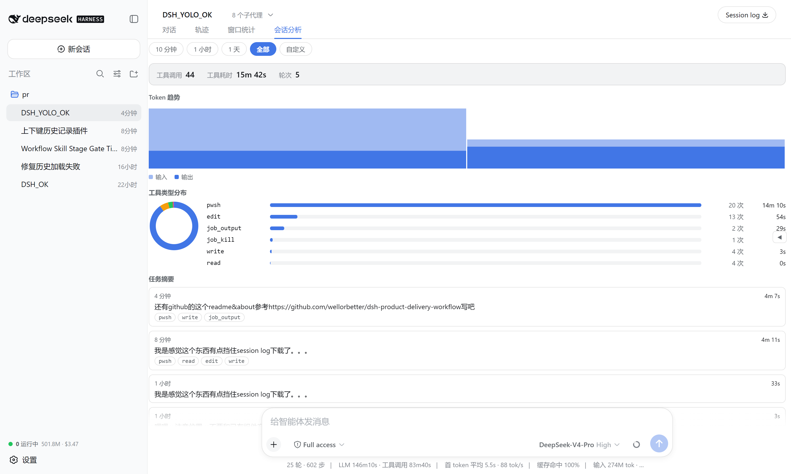

<h1 align="center">Window Stats</h1>

<p align="center">
  <a href="README.md">English</a>&nbsp;|&nbsp;<a href="README.zh.md">中文</a>
</p>

<p align="center">
  <a href="https://github.com/wellorbetter/dsh-plugin-window-stats/blob/main/LICENSE"></a>
  <a href="https://github.com/deepseek-ai/deepseek-harness"></a>
  <a href="https://github.com/topics/dsh-plugin"></a>
</p>

<p align="center">
  <strong>A DeepSeek Harness web plugin that shows every session's conversation progress and token usage at a glance.</strong><br>
  <em>All-windows overview · session analysis · cost estimation · token heatmap.</em><br>
  <strong>100% read-only and local</strong> — no outbound requests, no session writes.
</p>

<p align="center"></p>

<p align="center"></p>

## What this plugin provides

Installing this bundle adds a cross-session observability surface to every session of the target dsh profile. It reads the official `tokenUsage` / `sessionStats` / `contextPressure` / `contextBreakdown` projections (plus a `tokenHistory` projection it registers itself), so no host service or new RPC is required beyond that one projection unit.

| Surface | What it shows |
|---|---|
| `窗口统计` view tab | One row per session: status, turns/steps, input/output tokens, cache-hit ratio, context occupancy, duration, cost, last activity — with sort / filter / group-by-workspace / model & currency selectors, and a right detail panel (token buckets, context composition, timing, heatmap). |
| `会话分析` view tab | Time-range analysis (presets + custom) of the current session: token trend chart, tool-type duration distribution (donut + bars), and per-turn task summaries. |
| Sidebar footer summary | Always-visible running count, total tokens, and cost. |
| Right overview drawer | Collapsed by default; expands to a running-sessions + top-token-consumers + recent-activity panel with click-to-open. |

## Data source

| Displayed | Source |
|---|---|
| turns / steps / wall times | `sessionStats` projection |
| input / output / cache tokens | `tokenUsage` projection |
| context occupancy / composition | `contextPressure` + `contextBreakdown` projections |
| per-day token history (heatmap) | `tokenHistory` projection (registered by this plugin) |
| status | `SessionSummary.running` / `pendingInteraction` / `completed` |

Cost is estimated from DeepSeek's official pricing (V4-Flash / V4-Pro, cache-hit / cache-miss / output priced separately) with USD / CNY / EUR / GBP / JPY switching.

## Install

Requires the `dsh` CLI ([install DeepSeek Harness](https://github.com/deepseek-ai/deepseek-harness)).

```sh
# from GitHub (recommended)
dsh plugin --profile web add github:wellorbetter/dsh-plugin-window-stats

# or from a local checkout
dsh plugin --profile web add ./dsh-plugin-window-stats
```

Restart the profile (`dsh web`) after installing. The plugin is a [bundle](https://github.com/deepseek-ai/deepseek-harness/blob/master/docs/user/develop/basic/publish.md): it declares `dsh.bundle.patch`, so `dsh plugin` reconciles it into the profile's `dsh.profile.bundles` automatically. It ships pre-built JavaScript (`lib/`), so a GitHub install needs no build step or `allowBuilds` permission.

## Use

After restarting `dsh web`:

- **Sidebar** — the footer shows running count + total tokens + cost at all times.
- **窗口统计 tab** — open any session and click the tab to see every session's progress, tokens, and cost; click a row for a rich breakdown; use the toolbar to sort / filter / group / switch model & currency.
- **会话分析 tab** — analyze the current session over a time range, by tool type, with a token trend chart and task summaries.
- **Right drawer** — click the edge handle to expand the running / top-tokens / recent overview, click any row to open it.

## Development

```sh
pnpm install
pnpm verify   # typecheck + build + test
```

## License

MIT
