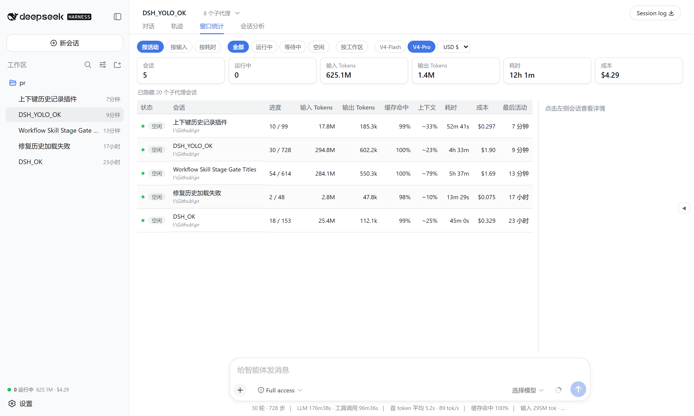

<h1 align="center">Window Stats（窗口统计）</h1>

<p align="center">
  <a href="README.md">English</a>&nbsp;|&nbsp;<a href="README.zh.md">中文</a>
</p>

<p align="center">
  <a href="https://github.com/wellorbetter/dsh-plugin-window-stats/blob/main/LICENSE"></a>
  <a href="https://github.com/deepseek-ai/deepseek-harness"></a>
  <a href="https://github.com/topics/dsh-plugin"></a>
</p>

<p align="center">
  <strong>一个 DeepSeek Harness Web 插件：一屏看全所有会话的对话进度与 Token 消耗。</strong><br>
  <em>全窗口总览 · 会话分析 · 成本估算 · Token 热力图。</em><br>
  <strong>100% 只读、纯本地</strong> —— 不发起外部请求、不写任何会话数据。
</p>

<p align="center"></p>

## 这个插件提供什么

安装此 bundle 后，目标 dsh profile 的每个会话都会多出一套跨会话观测界面。它读取官方 `tokenUsage` / `sessionStats` / `contextPressure` / `contextBreakdown` 投影（外加它自己注册的 `tokenHistory` 投影），因此除了那一个投影单元外，无需 host 服务或新增 RPC。

| 界面 | 展示内容 |
|---|---|
| `窗口统计` 页签 | 每个会话一行：状态、轮次/步数、输入/输出 Token、缓存命中率、上下文占用、耗时、成本、最后活动 —— 支持排序 / 过滤 / 按工作区分组 / 模型与货币切换，右侧详情面板（Token 四桶、上下文组成、耗时、热力图）。 |
| `会话分析` 页签 | 当前会话按时间范围（预设 + 自定义）分析：Token 趋势图、工具类型时长分布（环形图 + 条形图）、每轮任务摘要。 |
| 侧边栏底部摘要 | 常驻显示运行中数量、总 Token、总成本。 |
| 右侧总览抽屉 | 默认收起；展开后显示运行中会话 + Token 消耗 Top + 最近活动，点击直接打开。 |

## 数据来源

| 展示 | 来源 |
|---|---|
| 轮次 / 步数 / 耗时 | `sessionStats` 投影 |
| 输入 / 输出 / 缓存 Token | `tokenUsage` 投影 |
| 上下文占用 / 组成 | `contextPressure` + `contextBreakdown` 投影 |
| 每日 Token 历史（热力图） | `tokenHistory` 投影（本插件注册） |
| 状态 | `SessionSummary.running` / `pendingInteraction` / `completed` |

成本按 DeepSeek 官方定价估算（V4-Flash / V4-Pro，缓存命中 / 未命中 / 输出分开计价），支持 USD / CNY / EUR / GBP / JPY 切换。

## 安装

需要 `dsh` CLI（[安装 DeepSeek Harness](https://github.com/deepseek-ai/deepseek-harness)）。

```sh
# 从 GitHub 安装（推荐）
dsh plugin --profile web add github:wellorbetter/dsh-plugin-window-stats

# 或本地 checkout
dsh plugin --profile web add ./dsh-plugin-window-stats
```

安装后重启 profile（`dsh web`）。该插件是一个 [bundle](https://github.com/deepseek-ai/deepseek-harness/blob/master/docs/user/develop/basic/publish.md)：它声明了 `dsh.bundle.patch`，因此 `dsh plugin` 会自动把它对账进 `dsh.profile.bundles`。它内置了预构建的 JavaScript（`lib/`），所以 GitHub 安装无需构建步骤或 `allowBuilds` 权限。

## 使用

重启 `dsh web` 后：

- **侧边栏** —— 底部常驻显示运行中数量 + 总 Token + 总成本。
- **窗口统计页签** —— 打开任一会话点该页签，即可看到所有会话的进度、Token、成本；点某行看详细分解；用工具栏排序 / 过滤 / 分组 / 切换模型与货币。
- **会话分析页签** —— 按时间范围、按工具类型分析当前会话，含 Token 趋势图与任务摘要。
- **右侧抽屉** —— 点右边缘把手展开运行中 / Token Top / 最近活动总览，点任意行直接打开。

## 开发

```sh
pnpm install
pnpm verify   # typecheck + build + test
```

## License

MIT
