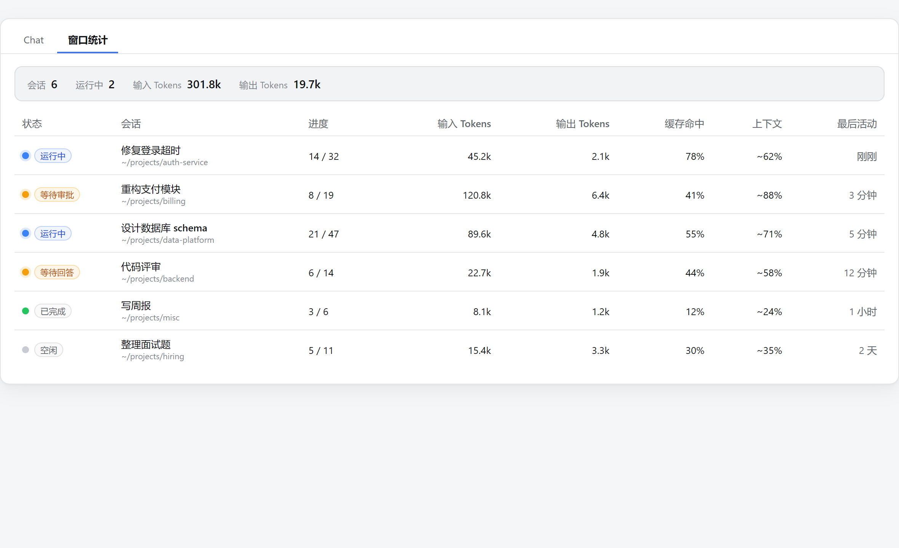

<div align="center">

# 🪟 dsh-plugin-window-stats

**A DSH web plugin — see every session's conversation progress and token usage at a glance.**

<code>all-windows overview</code> · <code>live updates</code> · <code>token stats</code> · <code>read-only</code>

[🌏 中文](./README.md) · [English](./README_EN.md)

<p>
  <a href="https://github.com/wellorbetter/dsh-plugin-window-stats"></a>
  <a href="https://github.com/topics/dsh-plugin"></a>
  <a href="./LICENSE"></a>
  <a href="https://github.com/wellorbetter/dsh-plugin-window-stats"></a>
</p>

</div>



<details>
<summary><b>📷 Real-world screenshot (live DSH GUI)</b></summary>


</details>

## ✨ Features

- 🗂️ **All-windows overview**: one row per session — status (running / waiting for approval / waiting for your answer / plan review / completed / idle), title, turns/steps, input/output tokens, cache-hit ratio, context occupancy, and last activity.
- 🧹 **Hides subagents**: shows only top-level sessions by default, hiding internal child-agent (subagent) sessions so the list isn't flooded by internal work.
- 📊 **Aggregate header**: total sessions, running count, and summed input/output tokens at a glance.
- 🖱️ **Click to jump**: activating a row opens that session — no tab hunting.
- ⚡ **Live updates**: data rides the official projection push (`session/projection` frames); running sessions update without a manual refresh.
- 🔒 **Read-only & local-only**: no outbound network requests, no session writes, no host service, no new RPC.

## 🚀 Install

> Prerequisite: DSH installed (`dsh web` runs).

```sh
# from GitHub (pre-built lib/ is committed — works out of the box, no allowBuilds)
dsh plugin --profile web add github:wellorbetter/dsh-plugin-window-stats

# from npm (after publishing)
dsh plugin --profile web add @wellorbetter/dsh-plugin-window-stats

# local development
dsh plugin --profile web add link:<path>
```

Then **restart `dsh web`**; the "Window Stats" tab appears in the view ring of any session.

<details>
<summary><b>Verify it took effect (optional)</b></summary>

```sh
dsh --profile web --dump-config
# expect a "# == @wellorbetter/dsh-plugin-window-stats" layer and an "id: window-stats" row
```

</details>

Uninstall:

```sh
dsh plugin --profile web remove @wellorbetter/dsh-plugin-window-stats
```

## 📊 Data source

The table reads each row's `projectionValues` from the client's global `useSessions` snapshot (readable without opening any session):

| Displayed | Source |
|---|---|
| turns / steps | `sessionStats` projection (`turns` / `steps` over the whole log) |
| input / output / cache tokens | `tokenUsage` projection (`uncachedInputTokens` + `cacheReadTokens` + `cacheWriteTokens` / `outputTokens`) |
| cache-hit ratio | `cacheReadTokens ÷ input tokens` (clamped 0–100%) |
| context occupancy | `contextPressure` projection (`~projectedTokens / contextWindow`, approximate) |
| status | `SessionSummary.running` / `pendingInteraction` / `completed` |

These projections are computed on the host by the official `dsh-session-stats` and `dsh-token-meter` units and delivered on `session.list` rows and `session/projection` push frames (higher-seq-wins).

## 📁 Project layout

```
dsh-plugin-window-stats/
├── src/
│   ├── index.ts                 # host half (empty apply)
│   ├── invariant.ts             # package invariant companion
│   └── client/                  # browser half ("./client" entry)
│       ├── index.ts             # inject + apply: registers the Window Stats tab
│       ├── stats.ts             # pure derivation: row model / aggregate / formatting
│       ├── locales.ts           # zh / en dictionaries
│       ├── WindowStatsView.tsx  # table view component
│       └── WindowStatsView.module.css
├── tests/                       # 15 cases (derivation / view / apply·dispose)
├── cordis.patch.yml             # bundle layer (id: window-stats)
├── tsdown.config.ts             # host + client build (ModuleLoader wrapper + purity gate)
└── lib/                         # pre-built artifacts (committed for github: installs)
```

## Model Experience

None — this plugin renders a read-only client view over projections the host already computes; it adds no prompt, message, schema, tool, or model call.

#### KV Cache effect

None — it never assembles or sends a provider request.

## 🛠 Development & build

```sh
pnpm install
pnpm verify      # typecheck + build + test
pnpm test        # vitest run (15 cases)
```

Artifacts: `lib/index.js` (host half), `lib/invariant.js`, `lib/client.js` (browser bundle wrapped in `window.__ModuleLoader__.load`).

## 📦 Publish to GitHub (`gh`)

```sh
cd plugin
git init && git add -A && git commit -m "dsh-plugin-window-stats v0.1.0"
gh repo create dsh-plugin-window-stats --public --source=. --push
gh repo edit wellorbetter/dsh-plugin-window-stats --add-topic dsh-plugin --add-topic dsh --add-topic deepseek
```

> Why commit `lib/`: `dsh plugin add github:...` fetches Git sources (not npm build output). The official path is a self-contained `prepare` script, but pnpm ≥10 blocks build scripts for Git deps; this repo commits the pre-built `lib/` instead, so `github:` installs work with no `allowBuilds`.

## ⚠️ Known limitations

- **Cold-session projections can lag**: a session never opened in this process reads its list-row projections from the projection cache (persisted every 200 events / 5 s), so it can trail live values; opened sessions are live.
- **Read-only, no history charts**: current snapshot only; no billing, export, or time series.
- **Context occupancy is approximate**: `projectedTokens` uses the official 4-chars/token heuristic plus a provider anchor; the UI prefixes it with `~`.
- **Sort/group**: v1 sorts by last activity descending; grouping by workspace and sorting by tokens are follow-ups.
- **Session-scoped tab**: the view ring belongs to the current session, so every session's tab ring shows the same global dashboard (content is session-independent).

## 🖥 Platform support

- Web (`dsh.client.platform: 'web'`); any desktop/server environment running the DSH web GUI.
- Depends on the public `@deepseek-ai/*@0.1.0-rc.6` contracts.

## 📄 License

[MIT](./LICENSE) © 2026 wellorbetter
